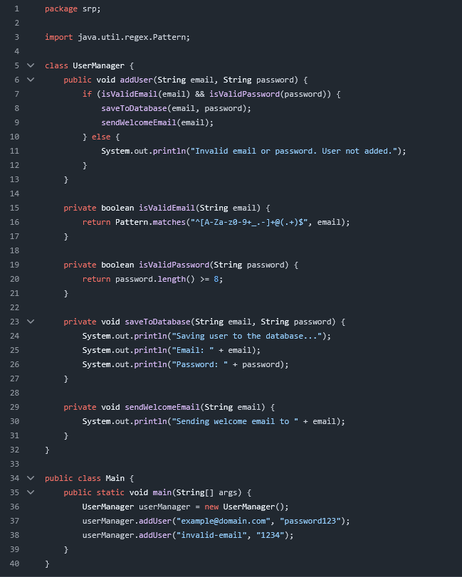
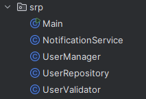
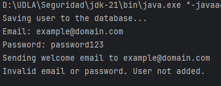

# Principio de Responsabilidad Única (SRP)

Este proyecto demuestra cómo refactorizar una clase que viola el principio SRP.

## Problema original

La clase `UserManager` validaba, guardaba y notificaba usuarios, teniendo múltiples razones para cambiar.

En el código original, la clase UserManager viola el Principio de Responsabilidad Única (SRP) al asumir múltiples funciones: valida datos, guarda información y envía notificaciones. Esto genera varias razones para modificar la clase, lo que complica su mantenimiento, pruebas y reutilización.
Al mezclar lógica de negocio, persistencia y notificaciones, se vuelve difícil adaptar el sistema a cambios futuros sin afectar otras partes. Para cumplir con SRP, se propone dividir estas responsabilidades en clases separadas: UserValidator, UserRepository, NotificationService y una clase UserManager que solo coordine el flujo.

## Solución

Se crearon las clases:

- `UserValidator`
- `UserRepository`
- `NotificationService`
- `UserManager` (flujo principal)



## ✅ Solución Aplicada

Se separaron las responsabilidades en **cuatro clases especializadas**. Cada clase ahora cumple una **única función claramente definida**, lo que mejora el mantenimiento, escalabilidad y testeo del sistema.

### 📦 `UserValidator.java`

Encargada de validar la entrada del usuario:

- Verifica que el **correo electrónico** sea válido mediante una expresión regular.
- Valida que la **contraseña** tenga al menos 8 caracteres.
- Contiene un método `isValidUser()` que combina ambas validaciones.

### 💾 `UserRepository.java`

Encargada de simular la **persistencia** de los datos del usuario:

- Implementa el método `save()` que imprime en consola los datos del usuario.
- En una aplicación real, esta clase manejaría la conexión con la base de datos.

### ✉️ `NotificationService.java`

Encargada de la **lógica de notificación** al usuario:

- Implementa el método `sendWelcomeEmail()` que simula el envío de un correo de bienvenida.

### 🧩 `UserManager.java`

Clase principal que **coordina** las demás clases:

- Usa `UserValidator`, `UserRepository` y `NotificationService` mediante **inyección por constructor**.
- Contiene el método `addUser()` que:
    1. Valida los datos.
    2. Guarda el usuario si es válido.
    3. Envía la notificación correspondiente.

---


## 🧪 Ejecución del Programa

Cada clase tiene una única responsabilidad. El sistema es más mantenible y fácil de testear.



---

# Reflexión sobre el Principio Abierto/Cerrado (OCP)

## Contexto del Problema

El proyecto inicial presentaba una violación clara del Principio Abierto/Cerrado (OCP) en la clase `NotificationService`. Esta clase era responsable de enviar diferentes tipos de notificaciones (Correo Electrónico, SMS, Push) y utilizaba una estructura condicional (`if-else if`) para determinar la lógica de envío basada en el tipo de notificación recibido.

El problema fundamental de este diseño era que cada vez que se necesitaba añadir un nuevo tipo de notificación (por ejemplo, Fax o notificaciones por una nueva aplicación), se hacía indispensable modificar directamente el código fuente de `NotificationService`. Esta práctica generaba un código rígido y frágil, altamente propenso a errores, especialmente a medida que la aplicación crecía y se añadían más funcionalidades, incrementando la dificultad de mantenimiento.

## Aplicación del Principio Abierto/Cerrado (OCP)

Para solucionar esta problemática y adherirse al OCP, se llevó a cabo una refactorización estratégica:

1.  **Definición de una Interfaz Común (`Notification`)**: Se creó una interfaz `Notification` que declara un método `send(String message)`. Esta interfaz actúa como un contrato que todas las implementaciones de notificación deben seguir, estableciendo una abstracción para el proceso de envío.

2.  **Creación de Clases de Notificación Específicas**: Se implementaron clases concretas para cada tipo de notificación existente: `EmailNotification`, `SMSNotification` y `PushNotification`. Cada una de estas clases implementa la interfaz `Notification` y contiene la lógica específica para enviar su respectivo tipo de mensaje. Esto encapsula la funcionalidad de envío dentro de sus propias clases, haciendo que cada una sea responsable de su tipo de notificación.

3.  **Refactorización de `NotificationService`**: La clase `NotificationService` fue modificada para depender de la interfaz `Notification` en lugar de las implementaciones concretas. Ahora, su método `sendNotification` acepta un objeto de tipo `Notification` y delega la responsabilidad de envío a este objeto, utilizando polimorfismo.

```java
// Interfaz para métodos de notificación
interface Notification {
    void send(String message);
}

// Implementaciones de métodos de notificación
class EmailNotification implements Notification {
    @Override
    public void send(String message) {
        System.out.println("Sending Email: " + message);
    }
}

class SMSNotification implements Notification {
    @Override
    public void send(String message) {
        System.out.println("Sending SMS: " + message);
    }
}

class PushNotification implements Notification {
    @Override
    public void send(String message) {
        System.out.println("Sending Push Notification: " + message);
    }
}

// Clase NotificationService que delega el proceso a las implementaciones
class NotificationService {
    public void sendNotification(Notification notification, String message) {
        notification.send(message);
    }
}

public class Main {
    public static void main(String[] args) {
        NotificationService service = new NotificationService();

        // Procesar diferentes métodos de notificación
        service.sendNotification(new EmailNotification(), "Hello via Email!");
        service.sendNotification(new SMSNotification(), "Hello via SMS!");
        service.sendNotification(new PushNotification(), "Hello via Push Notification!");

        // Si se añade un nuevo tipo de notificación (ej. FaxNotification), no se modifica NotificationService
        // class FaxNotification implements Notification {
        //     @Override
        //     public void send(String message) {
        //         System.out.println("Sending Fax: " + message);
        //     }
        // }
        // service.sendNotification(new FaxNotification(), "Hello via Fax!");
    }
}
```


# Reflexión sobre el Principio de Inversión de Dependencias (DIP)

## Contexto del Problema

En la implementación original del módulo de pagos, la clase `PaymentProcessor` dependía directamente de la clase concreta `CreditCardPayment`. Esto generaba un acoplamiento fuerte, dificultando la extensión del sistema para soportar nuevos métodos de pago como PayPal o Crypto, ya que cualquier cambio requería modificar la lógica interna de `PaymentProcessor`. Esta situación violaba el Principio de Inversión de Dependencias (DIP) y el Principio Abierto/Cerrado (OCP).

## Aplicación del DIP

Para resolver este problema, se refactorizó el código de la siguiente manera:

- Se creó la interfaz `PaymentMethod`, que define el contrato para cualquier método de pago.
- Se implementaron las clases concretas `CreditCardPayment`, `PayPalPayment` y `CryptoPayment`, cada una siguiendo la interfaz `PaymentMethod`.
- `PaymentProcessor` ahora depende de la abstracción `PaymentMethod` y recibe la implementación concreta mediante inyección de dependencias (por el constructor).

## Beneficios Obtenidos

- **Desacoplamiento:** Ahora `PaymentProcessor` no necesita conocer los detalles de cada método de pago, solo interactúa con la interfaz.
- **Extensibilidad:** Es posible agregar nuevos métodos de pago sin modificar el código existente de `PaymentProcessor`, cumpliendo con el OCP.
- **Mantenibilidad:** El código es más limpio, modular y fácil de mantener o probar.

## Ejemplo de Uso

```java
PaymentMethod creditCard = new CreditCardPayment();
PaymentMethod paypal = new PayPalPayment();
PaymentMethod crypto = new CryptoPayment();

PaymentProcessor processor1 = new PaymentProcessor(creditCard);
processor1.makePayment(150.0);

PaymentProcessor processor2 = new PaymentProcessor(paypal);
processor2.makePayment(200.0);

PaymentProcessor processor3 = new PaymentProcessor(crypto);
processor3.makePayment(300.0);
```

Con esta refactorización, el sistema de pagos es flexible y preparado para el crecimiento futuro, alineándose con los principios SOLID.
